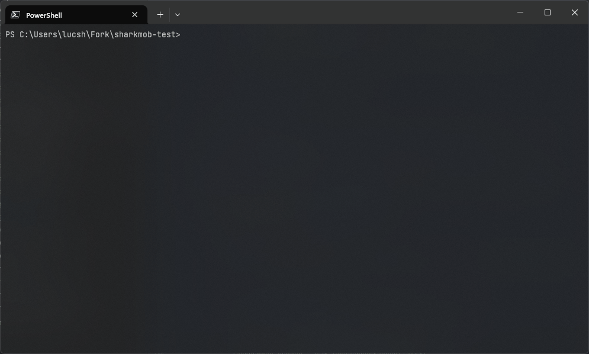
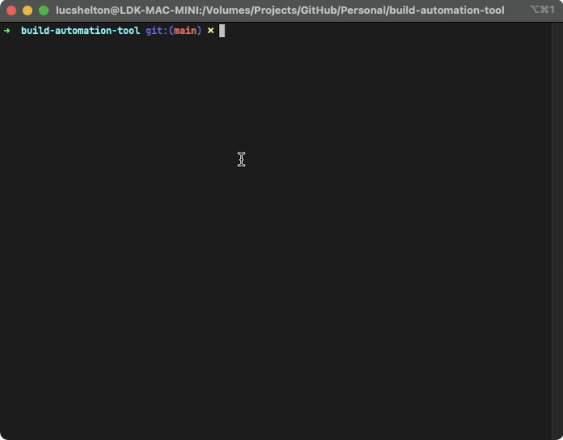

# build-automation-tool

A tool for automating a sequence of build operations that are defined as a task dependency graph.

This project was originally developed as a test sample for a job interview process. The project was well-received but I decided to open-source the tool because I did not want to waste the effort that was invested in building it.

I've chosen to anonymize the company. Any found references to an existing company is purely coincidental.

## Instructions

For instructions on usage, please navigate to [INSTRUCTIONS.md](INSTRUCTIONS.md)

### 📁 Tool

Contains the source files for the *Build Automation Tool*. This is the solution for running the scripts in the order described in the technical test requirements file.

## Demonstration

### Parallel

### Sequential

