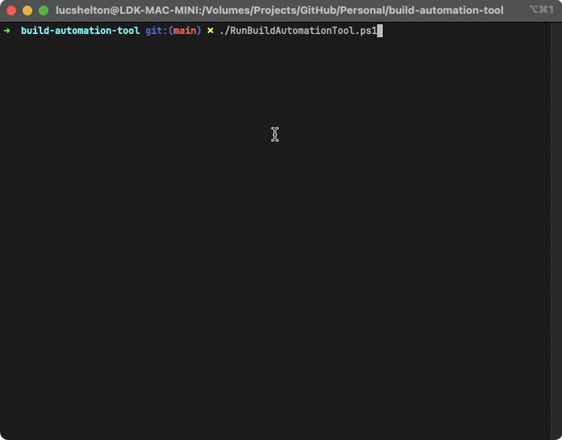

# build-automation-tool

A tool for automating a sequence of build operations defined as a task dependency graph.

This project was originally developed as a test sample for a job interview process. The project was well-received, and I decided to open-source the tool to share the effort invested in building it.

This project borrows ideas from **[Cake Build](https://cakebuild.net/)**, **[MSBuild](https://github.com/dotnet/msbuild)**, and **[BuildGraph](https://dev.epicgames.com/documentation/en-us/unreal-engine/buildgraph-for-unreal-engine)**, in that it uses a [Directed-Acyclic Graph](https://en.wikipedia.org/wiki/Directed_acyclic_graph) for describing the chronological order for the invocation of defined tasks.

## Table of Contents

- [build-automation-tool](#build-automation-tool)
  - [Table of Contents](#table-of-contents)
  - [Features](#features)
  - [Dependencies](#dependencies)
  - [Usage](#usage)
  - [Instructions](#instructions)
    - [📁 Tool](#-tool)
  - [Demonstration](#demonstration)
    - [Parallel](#parallel)
    - [Sequential](#sequential)

## Features

- Automates build operations based on task dependencies.
- Supports parallel and sequential execution of tasks.
- Visual demonstration of task execution with animated GIFs.

## Dependencies

- **PowerShell**: The scripts are written in PowerShell, so make sure you have PowerShell installed.
- **.NET Core SDK**: Ensure that the .NET Core SDK is installed for compiling and running the tool.

## Usage

The tool provides several PowerShell scripts that you can run:

1. **Build.ps1** - Used to execute the build process based on task dependencies.
2. **BumpVersion.ps1** - Increments the version number of the project.
3. **Publish.ps1** - Publishes the tool, creating a distributable package.
4. **RunBuildAutomationTool.ps1** - Main script to run the build automation tool with specified tasks.

## Instructions

For instructions on usage, please navigate to [INSTRUCTIONS.md](INSTRUCTIONS.md)

### 📁 Tool

Contains the source files for the *Build Automation Tool*. This is the solution for running the scripts in the order described in the technical test requirements file.

## Demonstration

This tool can run in two modes, **parallel** and **sequential**.

- **Parallel:** Attempt to run tasks in parallel that have shared dependencies, but are not interdependent on each other.
- **Sequential:** Run all tasks sequentially in chronological ordering derived from task dependencies.

### Parallel

### Sequential

